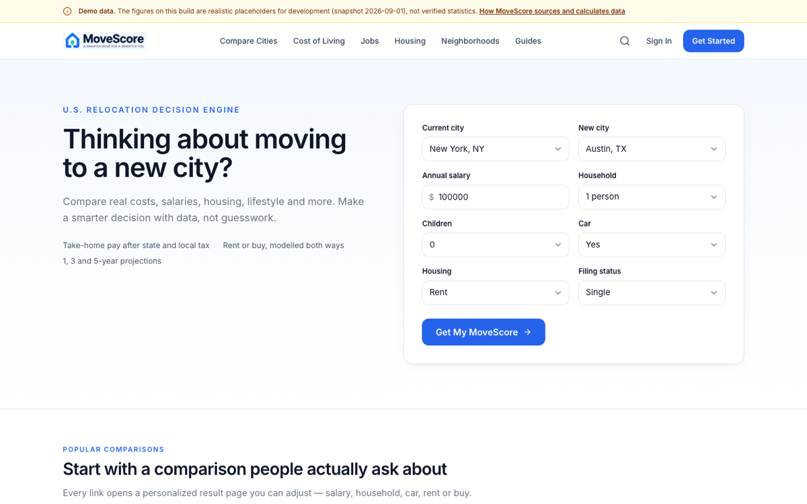
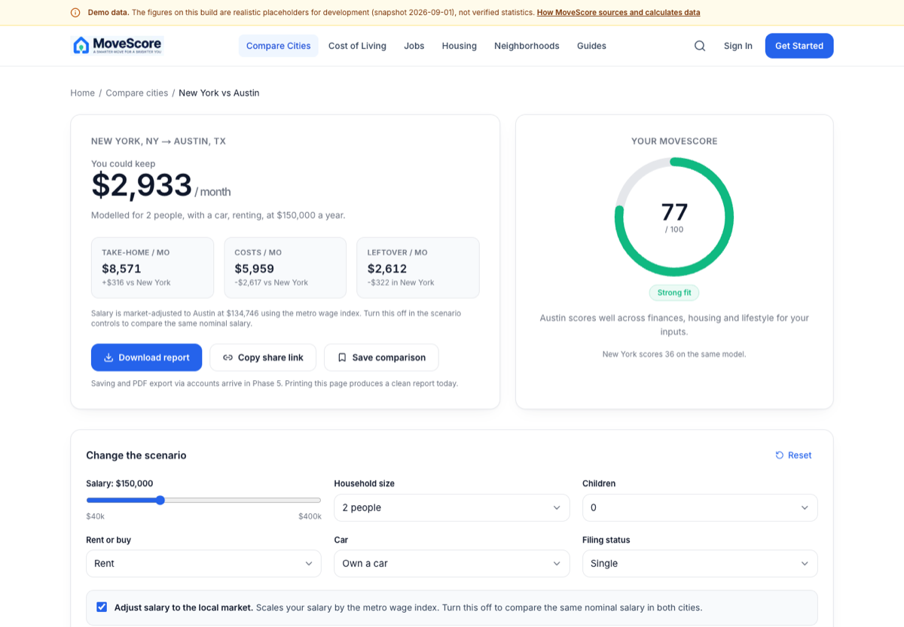
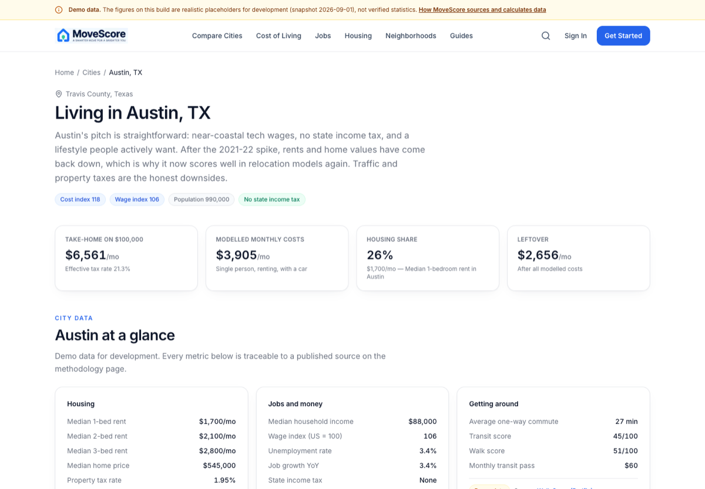
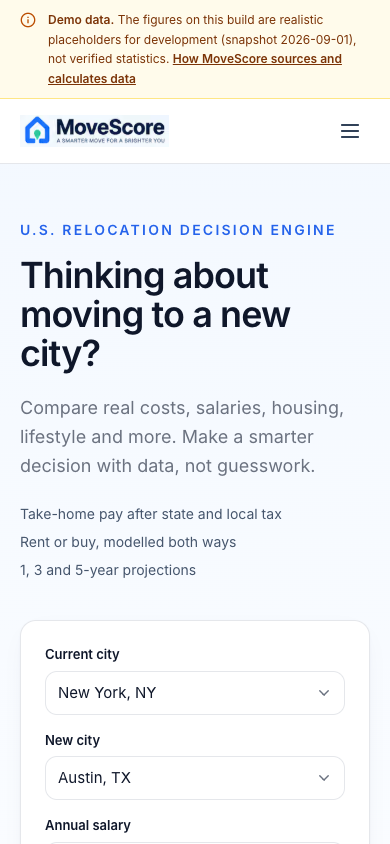

<div align="center">


# MoveScore

**A smarter move for a brighter you.**

A personalized U.S. relocation decision engine. Tell it where you live, where
you're thinking of moving, your salary and your household — MoveScore models
take-home pay, taxes, housing, cost of living and moving cost, then explains
every number it produced.

[](https://github.com/Rupeshkaadyan/movescore/actions/workflows/ci.yml)
[](https://nextjs.org)
[](https://www.typescriptlang.org)
[](https://tailwindcss.com)
[](#testing)
[](LICENSE)

</div>

<br />



---

## What it does

Most "cost of living" calculators tell you Austin is 12% cheaper than New York.
That's useless without *your* salary, *your* household and *your* housing
choice. MoveScore starts from you instead:

- **Take-home pay** — 2025 federal brackets, FICA with the wage base, state and
  local income tax, and an optional metro wage adjustment
- **Real monthly budget** — rent or mortgage, utilities, groceries, transport,
  healthcare, childcare, scaled by each city's own index
- **Moving cost** — distance × household weight, plus deposits and setup, with
  a months-to-break-even figure
- **1 / 3 / 5-year projections** — what the move actually nets over time
- **One MoveScore** — eight weighted categories, every driver named and
  explained, nothing hidden

Every scenario is a shareable URL. `?salary=150000&household=3&housing=own`
just works.

---

## Screenshots

<table>
  <tr>
    <td width="50%">
      
      <p><strong>The result dashboard.</strong> Score gauge, budget table,
      projections and moving cost — with a slider to rerun the scenario live.</p>
    </td>
    <td width="50%">
      
      <p><strong>City profiles.</strong> Housing, jobs, taxes, transport,
      climate, health and safety — each figure carrying its source.</p>
    </td>
  </tr>
  <tr>
    <td width="50%">
      
      <p><strong>Mobile.</strong> No horizontal scroll at 320px, verified
      programmatically across seven widths.</p>
    </td>
    <td width="50%">
      <p><strong>Also in the build:</strong></p>
      <ul>
        <li><code>/cost-of-living/&lt;city&gt;</code> — monthly breakdown</li>
        <li><code>/salary/&lt;city&gt;</code> — take-home calculator</li>
        <li><code>/move-cost</code> — standalone moving calculator</li>
        <li><code>/cities/&lt;city&gt;/neighborhoods</code> — 6 cities</li>
        <li><code>/methodology</code> — sources and formulas</li>
      </ul>
    </td>
  </tr>
</table>

---

## Quick start

```bash
git clone https://github.com/Rupeshkaadyan/movescore.git
cd movescore
npm install
npm run dev          # http://localhost:3000
```

No configuration is required — **every environment variable is optional.** The
app runs on its bundled dataset with nothing set.

| Command                 | What it does                              |
| ----------------------- | ----------------------------------------- |
| `npm run dev`           | Dev server with hot reload                |
| `npm run build`         | Production build                          |
| `npm run start`         | Serve the production build                |
| `npm run typecheck`     | `tsc --noEmit`                            |
| `npm run lint`          | ESLint — currently 0 errors, 0 warnings   |
| `npm test`              | Vitest — 51 tests                         |
| `npm run sample`        | Print a worked comparison to stdout       |
| `npm run qa:smoke`      | Browser smoke test (needs local Chrome)   |
| `npm run qa:responsive` | Overflow check at 7 widths                |

---

## Stack

| Layer    | Choice                                                          |
| -------- | --------------------------------------------------------------- |
| Frontend | Next.js 15 (App Router), React 19, TypeScript (strict)          |
| Styling  | Tailwind CSS v4 with brand tokens                               |
| Charts   | Hand-rolled SVG — no chart library, fully accessible            |
| Data     | Typed dataset in `src/lib/data` (Supabase schema ready)         |
| Deploys  | Vercel — every page statically prerendered                      |

---

## How the MoveScore is calculated

Eight categories, each exposing named drivers with raw values and a
plain-English explanation. Missing drivers renormalise; nothing is invented.

| Category      | Weight | Category       | Weight |
| ------------- | ------ | -------------- | ------ |
| Financial     | 30%    | Transportation | 8%     |
| Housing       | 18%    | Healthcare     | 6%     |
| Jobs          | 14%    | Weather        | 6%     |
| Taxes         | 12%    | Lifestyle      | 6%     |

The engine lives in `src/lib/calc/` as pure functions — no arithmetic in
components, so every rule is unit-testable.

---

## Data: read this before trusting a number

> **The shipped dataset is a labelled 30-city demo dataset.** The figures are
> realistic in magnitude, not verified statistics. The app says so on every
> page, and `DATA_STATUS` in `src/lib/data/sources.ts` is the single switch
> that flips the site to live data.

Every metric group is mapped to a real upstream source — Census, BLS, HUD,
NOAA, EPA, FBI, CMS — with publisher, URL, update cadence and methodology
note. See `/methodology` in the running app.

**No invented statistics.** If a figure is unavailable, the UI says it's
unavailable rather than filling the gap with something plausible. That rule is
written into `CONTRIBUTING.md`.

---

## Environment variables

Copy `.env.example` to `.env.local`. All values are optional.

| Variable                          | Needed           | Notes                                              |
| --------------------------------- | ---------------- | -------------------------------------------------- |
| `NEXT_PUBLIC_SITE_URL`            | **In production** | Canonical host. Wrong value = wrong canonicals.   |
| `NEXT_PUBLIC_SUPABASE_URL`        | Phase 3+         |                                                    |
| `NEXT_PUBLIC_SUPABASE_ANON_KEY`   | Phase 3+         | Safe to expose; RLS is what protects data.         |
| `SUPABASE_SERVICE_ROLE_KEY`       | Phase 3+         | **Server-only. Never add a `NEXT_PUBLIC_` prefix.** |
| `CENSUS_API_KEY`, `BLS_API_KEY`, `HUD_API_KEY`, `NOAA_API_KEY`, `EPA_API_KEY` | Phase 4 | Ingestion only |
| `NEXT_PUBLIC_ANALYTICS_ENDPOINT`  | Optional         | Empty = analytics disabled.                        |
| `NEXT_PUBLIC_SENTRY_DSN`          | Optional         | Empty = error monitoring disabled.                 |
| `INGEST_CRON_SECRET`              | Phase 4          | Guards `/api/ingest`.                              |

### Database

Supabase is **not required to run the site.** The schema is versioned; the app
simply doesn't connect yet.

```bash
supabase db push     # applies supabase/migrations/0001_init.sql
```

Every metric table carries `source`, `source_url`, `source_date`,
`last_updated` and `methodology_note` — provenance is part of the schema.

---

## Quality

- **51 unit tests** covering the calculation engine and URL parser
- **Lint and typecheck** clean, in CI on every push
- **Browser smoke test** — 11 assertions on the real user flow
- **Responsive test** — 63 checks (7 widths × 9 pages) for horizontal overflow
  and console errors; all clean
- **Performance** — TTFB 12–94ms, ~50 KB per page, 103 kB shared JS, every
  page statically prerendered

```bash
export NODE_PATH=/path/to/puppeteer-core/node_modules
npm run qa:smoke http://localhost:3000
npm run qa:responsive http://localhost:3000
```

---

## Project structure

```
src/
├── app/                    # routes (App Router)
│   ├── page.tsx            # homepage
│   ├── compare/[slug]/     # the result dashboard
│   ├── cities/[slug]/      # city profiles + neighborhoods
│   ├── cost-of-living/[slug], salary/[slug]/[amount]
│   ├── move-cost, search, methodology, guides
│   ├── privacy, terms, about, contact
│   └── sitemap.ts, robots.ts, error.tsx, not-found.tsx
├── components/
│   ├── ui/primitives.tsx   # Card, Button, Badge, ScoreBar, Breadcrumbs
│   ├── home/               # HeroSearch + homepage sections
│   ├── results/            # ScoreGauge, BudgetTable, tabs, projections
│   └── site/               # Header, Footer, DemoNotice
├── lib/
│   ├── calc/               # THE ENGINE — pure functions, no UI
│   │   ├── tax.ts          # federal brackets, FICA, state/local
│   │   ├── costOfLiving.ts # monthly budget model
│   │   ├── moveScore.ts    # transparent 8-category weighted score
│   │   ├── moveCost.ts     # distance + weight estimate
│   │   └── compare.ts      # orchestrator
│   ├── data/               # cities, neighborhoods, guides, sources
│   └── analytics.ts, seo.ts, query.ts, defaults.ts, format.ts
docs/                       # architecture, data, deployment, SEO, security
supabase/migrations/        # versioned schema with RLS
```

---

## Documentation

| Doc                            | What it covers                              |
| ------------------------------ | ------------------------------------------- |
| `docs/ARCHITECTURE.md`         | System shape, rendering strategy, boundaries |
| `docs/DATA.md`                 | Data model, provenance, ingestion, backups  |
| `docs/DEPLOYMENT.md`           | Vercel, domain, DNS, env, smoke tests       |
| `docs/SEO.md`                  | Metadata, sitemap, robots, Search Console   |
| `docs/ANALYTICS.md`            | Event list, privacy rules                   |
| `docs/SECURITY.md`             | Threat surface, secrets, headers, RLS       |
| `docs/LAUNCH-CHECKLIST.md`     | Done vs. needs-your-account                 |
| `docs/DECISIONS.md`            | Why this stack                              |
| `CONTRIBUTING.md`              | Rules that will get a PR rejected           |

---

## Roadmap

- [x] Frontend + demo dataset
- [x] Calculation engine with tests
- [x] SEO foundation, legal pages, analytics architecture
- [x] CI, production build, browser QA
- [ ] Supabase connection and real U.S. data ingestion
- [ ] Auth, saved comparisons, PDF reports
- [ ] Neighborhood coverage beyond 6 cities

## Known limitations

Stated plainly, because a relocation tool that overstates its data is worse
than no tool:

- **Demo dataset** — 30 cities, clearly labelled, not verified statistics
- **No accounts, no saved comparisons, no PDF export** — printing a result page
  produces a clean report today
- **Estimates, not tax advice** — published brackets only; ignores credits,
  deductions and filing subtleties
- **30 metros only** — anything else returns "not found", not a guessed number

MoveScore does not claim to be 100% accurate, does not name a "best city", and
does not guarantee savings.

---

## License

**Source-available, not open source.** Reading this code is welcome; using,
copying, modifying or deploying it is not, unless you ask first and I give
permission in writing. That includes private and internal use.

If you want to use any part of it — the engine, the data model, the design —
just [contact me](https://github.com/Rupeshkaadyan) and tell me what for. I do
say yes; I just want to know who's using it and how. See [LICENSE](LICENSE).

Built by [Rupesh Kadyan](https://github.com/Rupeshkaadyan) —
[LinkedIn](https://www.linkedin.com/in/rupesh-kadyan-aabb15331/).
